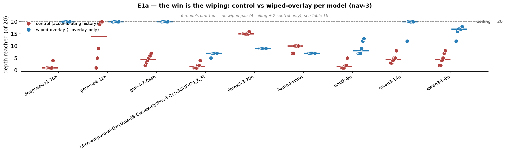

# LabyrinthBench

A deterministic multi-turn benchmark for language-model agents. The model navigates a maze of **gates** — checkpoints with mechanically verifiable answers — toward a single objective, the **exit**. No LLM sits anywhere in the judging loop: a run's score is the deepest gate it cleared, re-derivable from its trace by anyone.

**Who it's for:** people running local models who want to know what an agent actually does over 30 turns.
**What it is:** a deterministic multi-turn benchmark. No judge. The goalpost is set: get to the exit.
**When to use it:** before trusting a model in a long-horizon loop; when tuning a context strategy.
**Where it runs:** any OpenAI-compatible endpoint; Ollama on your own rig is the designed case.
**Why it exists:** it measures retention under interference — the thing accumulating-context chat benchmarks can't see — and scores it without an LLM anywhere in the loop.

Leaderboard: [labyrinthbench.ai](https://labyrinthbench.ai) · Data annex: [labyrinthbench.ai/data](https://labyrinthbench.ai/data) · Board rules: [METHODOLOGY.md](METHODOLOGY.md)

---

## The headline result: wiping history beat keeping it — in 7 of 9 models

On a 20-gate maze where later gates reference earlier answers, wiping a model's context every turn and re-injecting only its own recorded gate answers raised median depth by ≥5 gates — the pre-registered threshold, committed before any wiped run — in **7 of 9** models whose unaided baseline sat below the ceiling (n = 6 runs per model per condition, 13-model cohort).



- **The gains are large.** deepseek-r1:70b +19 (median 1 → 20), glm-4.7-flash +15.5, qwen3:14b +15.5, qwen3.5:9b +12.5, gemma4:12b +6, ornith:9b +6.5, Qwythos-9B +5.5. Four of the seven reached the exit outright — control exit rates of 0–33% became 83–100%.
- **Two models got worse.** llama3.3:70b −6 (15 → 9) and llama4:scout −3 (10 → 7). Parameter count does not predict the direction — deepseek-r1:70b (70B, baseline 1) gained the most while llama3.3:70b (70B, baseline 15) lost the most. The observable gradient is unaided baseline on this task: the two reversals belong to the two highest baselines in the band.
- **The mechanism is in the traces.** llama3.3:70b's wiped failure is confirmed perseveration: the re-injected answers carry no record of what already failed, and in every run it burns all four lives re-submitting the identical wrong answer. Its unwiped runs, with feedback intact, never perseverate — they fail later, differently.
- **Scope:** wiping lifted qwen3:14b to a 20/20 median (83% exits) — the same ceiling the 120B-class rows occupy unaided on this map. That sentence is the whole claim; on tasks where the decisive facts live outside what gets re-injected, the same lever inverts.
- **Cost, in the same table:** threshold-clearing models cut turns per gate cleared to 0.11–0.42× control, but per-turn cost can rise steeply — qwen3.5:9b re-derives its whole reasoning chain from the re-injected answers every turn: 21× the output volume, 10.5 → 150 s per turn.

Full brief, run-order tables, prereg with lock dates, and raw run logs: [results/e1a-table1/](results/e1a-table1/) and the [data annex](https://labyrinthbench.ai/data).

## You can't prompt the loop in

The harness ships a `--look-gate` flag, and the reason it's a flag and not a prompt is a measured result. On a 34-gate maze where values change and byte-identical questions recur, qwen3:14b answers before looking — median depth 5.5 of 34, every wrong answer an unobserved guess. *Telling* it to observe first (a registered one-line imperative) bought about one gate of median — inside noise, with every wrong answer still an unobserved guess. *Forcing* it — a five-line interceptor that converts any answer at an unobserved gate into an observation — took the same model to median 21+, zero guesses in all 12 forced runs. Full brief in the [annex](https://labyrinthbench.ai/data).

## Run it

### Rung 1 — taste (~10 minutes)

Two commands. Point `--base-url` at whatever OpenAI-compatible endpoint you already run (Ollama shown; LM Studio serves on port 1234).

```bash
docker compose -f docker-compose.standalone.yml up -d

docker compose -f docker-compose.standalone.yml exec labyrinth-bench \
  python cli/run_eval.py --model qwen3:14b \
  --base-url http://host.docker.internal:11434/v1
```

Then open **<http://localhost:8090/watch>** and watch the run live, turn by turn.

On Linux, `host.docker.internal` needs `--add-host` support or your machine's LAN IP in its place. Qwen3-family thinking models want `--no-think` for comparable runs.

### Rung 2 — the full paired cell

Reproduce the headline contrast on your own hardware: six runs with accumulating history, six with the per-turn wipe, same model, same maze.

```bash
# control: accumulating history
... cli/run_eval.py --model <M> --deg nav-3 --runs 6 --output /results/control.jsonl

# wiped: context cleared each turn, recorded gate answers re-injected
... cli/run_eval.py --model <M> --deg nav-3 --runs 6 --overlay-only --show-recall --output /results/wiped.jsonl
```

Compare median depths. Δ ≥ 5 is the same pre-registered threshold the cohort was scored against. Whichever direction your model moves, that's a datum — the board wants both.

### Rung 3 — submit

Until the dealer service and runner CLI ship (post-release), the board accepts entries as pull requests carrying the results JSONL — plus, for the harness lane, the harness code. Submission flow and verification: [METHODOLOGY.md §5](METHODOLOGY.md).

## The board

Two lanes, per [METHODOLOGY.md](METHODOLOGY.md):

- **Model lane** — harness pinned, models compete.
- **Harness lane** — model pinned (launch division: qwen3:14b at Q4_K_M, digest-tracked), context strategies compete. Open harness code is mandatory: an entry is code, and the board links it.

Rank is a conservative bound — the one-sided 95% bootstrap lower confidence bound on median depth — so large-n evidence tightens rank and a lucky small-n entry self-limits. Every dealt instance counts, aborts included. Efficiency columns (turns, pulls, lives) are metrics, never gates: exit is the only objective. Every entry sits on a displayed rung of the integrity ladder — replay-consistent → open → board-reproduced → contested.

The shipped wiping policy demonstrably doesn't win everywhere — two of nine cohort models got worse under it. Beat it.

## What's in the repo

| Path | What |
|---|---|
| `engine/` | Deterministic maze engine + instance mint (byte-deterministic from seed) |
| `cli/` | Evaluation harness (`run_eval.py`), analysis passes |
| `api/` | Scoring API + the live `/watch` view |
| `degs/` | Maze manifests |
| `results/e1a-table1/` | The headline cell: tables, figure, raw pass outputs |
| `METHODOLOGY.md` | Board rules: lanes, integrity ladder, scoring, verification limits |

License: MIT.
